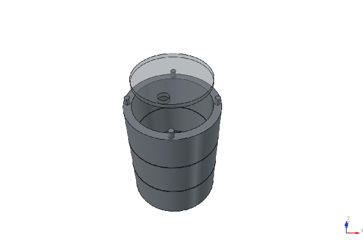

# Trash Robot:

Small self-contained bin capable of moving in an indoor environment, entirely in Python. A small intelligent robot (for an indoor environment) capable of going from point A to point B independently, the product user will have a station to execute commands/instructions remotely. It will have the shape of a small cylinder. Its height is modular (designed for 30cm, too much height is risky). The robot is segmented into several bases (to reduce printing costs).

A lid is provided to hide the BOM (components); simply lift the lid up to access the BOMs, insert your finger into the small hole, and lift/reassemble.

# BOM (Components):

[Link of the BOM, bought on Aliexpress](https://www.aliexpress.com/p/wish-manage/share.html?spm=a2g0o.best.headerAcount.6.2bb62c25vOnlII&smbPageCode=wishlist-amp&spreadId=9D17F73AD6E3321969CEB72831C0C71B5633AE79CA16C14777869F45B6FCB9BF)

And for the station, it's just a Esp32 (with Terminal), [module uwb with usb cable](https://fr.aliexpress.com/item/1005010436185037.html?pdp_ext_f=%7B%22sku_id%22%3A%2212000052397853232%22%7D&sourceType=1&spm=a2g0o.wish-manage-detail.0.0&gatewayAdapt=glo2fra) and a [push btn, 3V-6V, 16mn and Momentary](https://fr.aliexpress.com/item/1005008024309525.html?pdp_ext_f=%7B%22sku_id%22%3A%2212000043299777530%22%7D&sourceType=1&spm=a2g0o.wish-manage-home.0.0&gatewayAdapt=glo2fra)

The 3D modeling files were created on FreeCAD, they will be available soon. Contact me (via the bio of my Github account) if you really wanted them (so, may contain errors, or not at the latest version; I am in no way responsible for this). 

To see more pictures of the 3D modelling, see /img/: 
Main: Trash bin housing
Relay: Box to improve the performance of the robot, by storing a UWB module (in all, 3 UWB modules). 
Station: 

# Extra information!

Robot Trash uses "UWB" technology, which allows more accurate localization and positioning, it uses the type TWR (). Nevertheless; the number of UWB modules directly influences the system performance. 

# How does UWB TWR work?:

> [!WARNING]
> ### Warning
> 2 uwb-twr modules are mandatory! 

A first uwb module designated as the host sends a signal to the second module; the station records the time, then the tag (in this case, the robot), processes the response, and sends it back to the station (to the second uwb module), which performs a calculation (in seconds):

For a good understanding, keep in mind this example for the real operation:

The station and the robot contain a UWB module. The station has a "Come to my location" button, which launches the search. 

Time taken for the signal to reach the first module (Station to Robot, t1) -Time taken for the signal from the second module to reach the first module (t2) =                       

$$\text{Travel Time} = \frac{(t_2 - t_1) - \text{Robot Processing Time}}{2}$$

$$\text{Distance} = \text{Travel Time} \times c$$

> [!NOTE]
> **"c"** represents the speed of light, which corresponds to about $3 \times 10^5\text{ km/s}$ ($300,000\text{ km/s}$).

There you go! And the more UWB module you have, the more accurate and intelligent the robot/system will be. The "Trash-Autonomous" project offers 2 uwb modules (one in the trash bin box and another, presented as a "station"). Another box, named "Relay" is available if you want an improvement in precision.

I use FreeCAD btw.